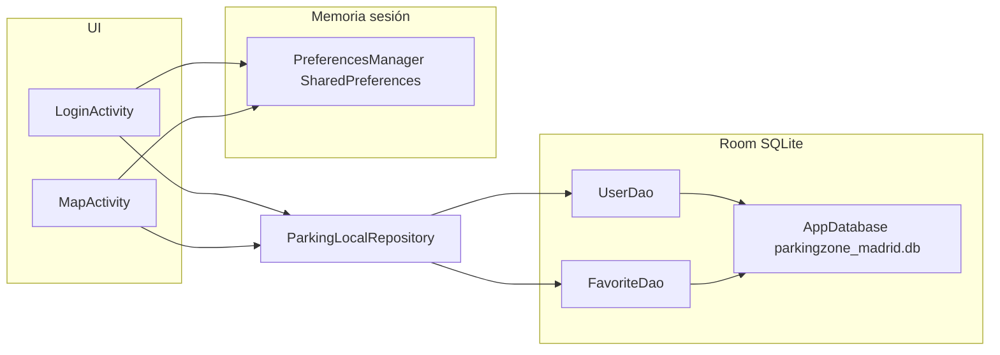

# Memoria del proyecto — ParkingZone Madrid (Android)

Este documento resume el **estado actual del código** tras estabilizar el repositorio (incluidos los reintentos y reversiones por conflictos al integrar cambios en `main`). Sirve para que cualquier compañera sepa **qué existe, para qué sirve y cómo encajan las piezas**, sin depender del chat.

**Ruta del módulo:** `Code_ParkingZone/APP/ParkingZoneMadrid/`

---

## 1. Contexto y objetivo del producto

- **Objetivo:** mostrar en un mapa las zonas SER (Servicio de Estacionamiento Regulado) de Madrid a partir de datos oficiales en CSV, con información de tarifa/horario y **favoritos por usuario** guardados en el dispositivo.
- **Problema que evitamos repetir:** mezclar en `main` cambios grandes sin revisión (por ejemplo modelos o refactors que no compilan o sobrescriben trabajo ajeno). Convención recomendada: **rama propia → PR pequeño → revisión → merge**.

---

## 2. Stack tecnológico (lo que “tocamos” en Gradle)

| Tecnología | Uso en el proyecto |
|------------|-------------------|
| **Kotlin** | Lenguaje principal de las pantallas y capa de datos. |
| **AndroidX** (AppCompat, Activity, ConstraintLayout, DrawerLayout, RecyclerView) | UI estándar; cajón lateral para favoritos y cabecera de tarifas. |
| **Material Components** | Toolbar, botones, estilo visual. |
| **View Binding** | Acceso tipado a vistas desde código (`ActivityLoginBinding`, etc.). |
| **Kotlin Coroutines + lifecycleScope** | Lectura de CSV, Room y actualización de UI en hilos adecuados (`Dispatchers.IO` / `Main`). |
| **Room 2.6.1** | Base de datos **SQLite local** (`users`, `favorite_zones`). |
| **osmdroid 6.1.18** | Mapas OpenStreetMap sin API key de Google Maps para los tiles. |
| **Google Maps (solo como app externa)** | Intents `geo:` / web para “Cómo llegar” si el usuario tiene Google Maps instalado. |

Definición de versiones: [`gradle/libs.versions.toml`](gradle/libs.versions.toml).  
Dependencias del app: [`app/build.gradle.kts`](app/build.gradle.kts).

---

## 3. Flujo de pantallas (AndroidManifest)

Archivo: [`app/src/main/AndroidManifest.xml`](app/src/main/AndroidManifest.xml).

- **Actividad de arranque (`LAUNCHER`):** `MapActivity` — al abrir la app entras directo al mapa.
- **`MainActivity`:** pantalla simple con botón para abrir el mapa (útil en desarrollo o si se cambia el launcher más adelante).
- **`LoginActivity`:** pantalla de “iniciar sesión” local (nombre + email); está declarada pero **no hay en el código actual un `startActivity` hacia ella desde el mapa** (convendría enlazarla desde toolbar/menú cuando el flujo de producto lo defina).

---

## 4. Datos: CSV oficial → modelo en memoria

### 4.1. Archivo de datos

- **Asset:** `app/src/main/assets/calles_SER_2026.csv`
- **Formato:** columnas separadas por **`;`** (punto y coma), con cabecera en la primera línea.
- **Interpretación:** cada fila del CSV es **una plaza**; en código se **agrupan** por par `(distrito, calle)` para tener un único punto por calle (promedio de coordenadas UTM de todas sus plazas).

### 4.2. Código que parsea y agrega

Clase: [`app/src/main/java/.../data/ParkingZonesData.kt`](app/src/main/java/com/example/parkingzonemadrid/data/ParkingZonesData.kt).

Responsabilidades:

1. Abrir el CSV desde `assets`.
2. Leer línea a línea, validar columnas mínimas (`parts.size >= 12`).
3. Acumular por clave `"$district|$rawStreet"` en un `MutableStreetSummary` (sumas de X/Y, conteos de color, tipo línea/batería, plazas).
4. Convertir coordenadas **UTM zona 30N → WGS84** (lat/lon) con el objeto interno `Utm30NConverter` (fórmulas elipsoide WGS84).
5. Derivar `ZoneType` (verde, azul, mixta, etc.) y `ParkingType` (línea, batería, mixto).
6. Generar `zoneId` estable como `abs(stableKey.hashCode())` donde `stableKey` es distrito + nombre de calle (importante para **favoritos en Room**, que guardan ese `Int`).
7. **Límite de rendimiento:** `MAX_ZONES_TO_RENDER = 1500` calles tras ordenar por `totalPlazas` (no se pintan todas las filas del CSV a la vez en el mapa).
8. **Caché en memoria:** `cachedZones` para no reparsear en cada llamada.

### 4.3. Modelo de dominio para el mapa

Archivo: [`app/src/main/java/.../data/model/StreetZone.kt`](app/src/main/java/com/example/parkingzonemadrid/data/model/StreetZone.kt).

- **`StreetZone`:** calle agregada con `zoneId`, distrito, nombre, tipo de zona, tipo de aparcamiento, lat/lon, totales de plazas.
- **`ZoneType`:** incluye textos de **tarifa resumida** y **horario** como propiedades para mostrar en UI (referencia tipo parking-madrid.es).
- **`ParkingType`:** línea / batería / mixto / otra.

---

## 5. Mapa (osmdroid) y UI del mapa

### 5.1. Actividad principal del mapa

Archivo: [`app/src/main/java/.../map/MapActivity.kt`](app/src/main/java/com/example/parkingzonemadrid/map/MapActivity.kt).

Qué hace:

1. **Configuración osmdroid:** `Configuration.getInstance().load(...)` y `userAgentValue = packageName` (requisito de buenas prácticas para el tile server).
2. **MapView:** tiles `MAPNIK`, zoom inicial ~13, centro Madrid.
3. **Toolbar + DrawerLayout:** el icono de navegación abre/cierra el cajón; dentro hay cabecera de tarifas (`include`) y lista de favoritos (`RecyclerView`).
4. **Carga de datos:** corrutina en `IO` que llama a `ParkingZonesData.getStreetZones` y, si hay usuario en preferencias, carga `favoriteZoneIds` desde Room vía `ParkingLocalRepository`.
5. **Marcadores:** por cada `StreetZone` se crea un `Marker` con icono según `ZoneType` (`pin_verde`, `pin_azul`, `pin_mixta`, `pin_otro`).
6. **InfoWindow personalizado:** `StreetInfoWindow` muestra tarifa, horario, plazas, botón favorito y “Cómo llegar”.
7. **Filtros del menú:** [`app/src/main/res/menu/menu_map.xml`](app/src/main/res/menu/menu_map.xml) — submenú para filtrar por tipo de aparcamiento (todas / línea / batería / mixto).
8. **Ciclo de vida:** `onResume`/`onPause` delegan en `mapView`; al destruir se guardan prefs de osm.

### 5.2. Popup de calle (InfoWindow)

Archivo: [`app/src/main/java/.../map/StreetInfoWindow.kt`](app/src/main/java/com/example/parkingzonemadrid/map/StreetInfoWindow.kt).

- Extiende `org.osmdroid.views.overlay.infowindow.InfoWindow`.
- Layout: [`app/src/main/res/layout/infowindow_street.xml`](app/src/main/res/layout/infowindow_street.xml).
- **`bind(zone, favorite)`** rellena textos y colores según `ZoneType`.
- **Callbacks** hacia `MapActivity`: `onFavoriteClicked` y `onNavigateClicked` (la ventana no toca Room ni intents directamente; solo notifica).

### 5.3. Lista de favoritos en el cajón

Archivo: [`app/src/main/java/.../map/FavoritesAdapter.kt`](app/src/main/java/com/example/parkingzonemadrid/map/FavoritesAdapter.kt).

- Layout por ítem: `item_favorite.xml`.
- Click en fila → centrar mapa y abrir popup; click en papelera → mismo flujo que quitar favorito.

---

## 6. Persistencia local: Room + SharedPreferences

Aquí está la decisión de “**qué base de datos usamos**”: **Room (SQLite) en el dispositivo**, no servidor remoto.

### 6.1. Base de datos Room

Archivo: [`app/src/main/java/.../data/local/AppDatabase.kt`](app/src/main/java/com/example/parkingzonemadrid/data/local/AppDatabase.kt).

- Nombre del fichero SQLite: **`parkingzone_madrid.db`**.
- **Versión:** `1` (`exportSchema = false` → no se exporta esquema JSON en build; si en el futuro subís versión de BD, habrá que definir **migraciones**).
- **Entidades:**
  - `UserEntity` — tabla `users`, clave primaria `email`, campo `name`.  
    [`UserEntity.kt`](app/src/main/java/com/example/parkingzonemadrid/data/local/entity/UserEntity.kt)
  - `FavoriteEntity` — tabla `favorite_zones`, clave compuesta `(user_email, zone_id)`.  
    [`FavoriteEntity.kt`](app/src/main/java/com/example/parkingzonemadrid/data/local/entity/FavoriteEntity.kt)
- **DAOs:**
  - `UserDao`: `upsert` (REPLACE), `getByEmail`.  
    [`UserDao.kt`](app/src/main/java/com/example/parkingzonemadrid/data/local/dao/UserDao.kt)
  - `FavoriteDao`: insert IGNORE, delete, listado de ids, `toggleFavorite` en transacción.  
    [`FavoriteDao.kt`](app/src/main/java/com/example/parkingzonemadrid/data/local/dao/FavoriteDao.kt)

### 6.2. Repositorio local

Archivo: [`app/src/main/java/.../data/repository/ParkingLocalRepository.kt`](app/src/main/java/com/example/parkingzonemadrid/data/repository/ParkingLocalRepository.kt).

- Encapsula `AppDatabase.getInstance(context)` y expone operaciones suspend: `upsertUser`, `getFavoriteZoneIds`, `toggleFavorite`, `isFavorite`.

### 6.3. Modelo de usuario en memoria (clase de dominio previa)

Archivo: [`app/src/main/java/.../model/Usuario.kt`](app/src/main/java/com/example/parkingzonemadrid/model/Usuario.kt).

- Data class con `id_usuario`, nombre, correo, password (vacía en flujo actual), lista `favoritos` en memoria (CRUD de `Favorito`).
- **`Usuario.generarId()`** usa un contador en `companion object` (ids volátiles entre reinicios de app); el **email** es lo que realmente ancla favoritos en Room.

### 6.4. Preferencias (sesión rápida)

Archivo: [`app/src/main/java/.../utils/PreferencesManager.kt`](app/src/main/java/com/example/parkingzonemadrid/utils/PreferencesManager.kt).

- Archivo SharedPreferences: `parking_zone_prefs`.
- Guarda `id`, `nombre`, `email` del último usuario “logueado”.
- `MapActivity` lee `getUser()?.correo` para saber si puede guardar favoritos.

### 6.5. Login (persistencia doble)

Archivo: [`app/src/main/java/.../utils/LoginActivity.kt`](app/src/main/java/com/example/parkingzonemadrid/utils/LoginActivity.kt).

1. Valida nombre y email (`Patterns.EMAIL_ADDRESS`).
2. Construye un `Usuario` y lo guarda en **SharedPreferences** (`prefsManager.saveUser`).
3. En `Dispatchers.IO` llama a **`repository.upsertUser(user)`** para reflejar el mismo usuario en **Room** (`UserEntity`).
4. Devuelve `RESULT_OK` y cierra la actividad.

**Idea de diseño:** las preferencias dan acceso rápido al email actual; Room da persistencia estructurada y relación con favoritos.

---

## 7. MainActivity (entrada alternativa)

Archivo: [`app/src/main/java/.../MainActivity.kt`](app/src/main/java/com/example/parkingzonemadrid/MainActivity.kt).

- `enableEdgeToEdge()` y padding con `WindowInsetsCompat`.
- Botón `btnOpenMap` → `Intent` a `MapActivity`.

Layout: [`activity_main.xml`](app/src/main/res/layout/activity_main.xml).

---

## 8. Recursos visuales relevantes

- **Pins del mapa:** `pin_verde.xml`, `pin_azul.xml`, `pin_mixta.xml`, `pin_otro.xml` en `res/drawable/`.
- **Colores de zona:** `colors.xml` — `zona_verde`, `zona_azul`, `zona_mixta`, `zona_otro` (usados en leyenda, cabecera del infowindow y lista de favoritos).
- **Cabecera del cajón:** `drawer_header_tarifas.xml` (resumen textual de tarifas SER).

---

## 9. Permisos

En el manifiesto:

- `INTERNET` y `ACCESS_NETWORK_STATE` — necesarios para **descargar teselas** del mapa OSM y para el fallback web de Google Maps.

---

## 10. Tabla resumen de archivos “núcleo”

| Área | Archivo principal |
|------|---------------------|
| Arranque / actividades | `AndroidManifest.xml` |
| Mapa | `map/MapActivity.kt` |
| Popup calle | `map/StreetInfoWindow.kt` |
| Lista favoritos UI | `map/FavoritesAdapter.kt` |
| CSV → modelo | `data/ParkingZonesData.kt` |
| Modelo calle | `data/model/StreetZone.kt` |
| Room BD | `data/local/AppDatabase.kt` |
| Favoritos DAO | `data/local/dao/FavoriteDao.kt` |
| Usuario DAO | `data/local/dao/UserDao.kt` |
| Acceso datos | `data/repository/ParkingLocalRepository.kt` |
| Login | `utils/LoginActivity.kt` |
| Sesión prefs | `utils/PreferencesManager.kt` |
| Modelo usuario | `model/Usuario.kt` |

---

## 11. Lecciones de colaboración (post-reversiones)

1. **Nunca empujar a `main` sin pull/rebase** y sin que el proyecto **compile** (`./gradlew assembleDebug` o Build en Android Studio).
2. **Cambios en Room** (entidades, `version`, queries) son de **alto impacto**: exigen migración o borrado de datos de prueba.
3. **Cambios en CSV o columnas** rompen `ParkingZonesData`: coordinar formato con quien mantenga el dataset.
4. **`zoneId` por hash**: si cambia la lógica de agregación o el nombre estable de calle, los favoritos guardados pueden **dejar de coincidir** con los marcadores nuevos.

---

## 12. Pendientes / mejoras obvias (para el backlog)

- Enlazar **`LoginActivity`** desde el mapa (menú o botón “Mi cuenta”) y refrescar `currentEmail` al volver con `RESULT_OK`.
- Sustituir o complementar el id volátil de `Usuario.generarId()` por algo estable si hace falta trazabilidad.
- Valorar **subir `exportSchema` y migraciones** cuando la BD deje de ser prototipo.
- Tests unitarios del parser CSV (casos borde: líneas vacías, columnas cortas, caracteres en nombres).

---

*Documento generado para el equipo del proyecto ParkingZone Madrid. Actualizar este archivo cuando cambie el flujo de navegación, el esquema Room o el formato del CSV.*
